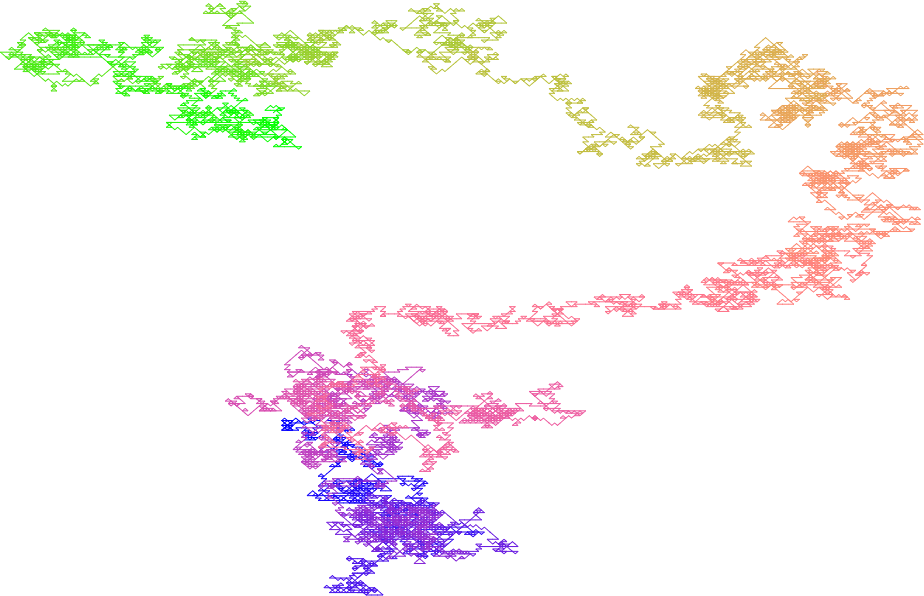

  <a href="" 
     class="btn btn-outline-secondary btn-sm"
     target="_blank" 
     rel="noopener noreferrer">
    GitHub
  </a>
  <a href="" 
     class="btn btn-outline-secondary btn-sm"
     target="_blank" 
     rel="noopener noreferrer">
    Website
  </a>

This is a sample abstract to showcase the flexibility of the HTML format.
We still support LaTeX commands
\begin{equation*}
	\int_\mathbb{R} f(x) \mathrm{d} x = \lim_{n \to \infty} \sum_{k} f(x_k) \Delta x_k.
\end{equation*}

**Theorem.** Theorems are stated as such, for example
\begin{equation*}
	1+1=2
\end{equation*}

We support images

<figure data-latex-placement="h">

<figcaption>Figure caption</figcaption>
</figure>

We also support multimedia embedding

<iframe width="100%" height="315" src="https://www.youtube.com/embed/0_GvG1ch8m0?si=ZOifSAoVS5Vvpq9X&amp;controls=0" title="YouTube video player" frameborder="0" allow="accelerometer; autoplay; clipboard-write; encrypted-media; gyroscope; picture-in-picture; web-share" referrerpolicy="strict-origin-when-cross-origin" allowfullscreen></iframe>

We also support interactive elements (e.g. JavaScript). Here is a random walk on a random graph

List references manually using numbers in square brackets in math
environment: $[1]$, $[2]$, etc.

**Bibliography**

$[1]$ Ken-Iti, S. (1999). *Lévy Processes and Infinitely Divisible
Distributions*. Cambridge University Press.

$[2]$ Jane Smith. \"Title of the Article.\" *Journal Name*, vol. X,
no. Y, Year, pp. Z.

$[3]$ [Wikipedia article about
Wrocław](https://en.wikipedia.org/wiki/Wroc%C5%82aw)

$[4]$ [Website of the Faculty of Pure and Applied Mathematics, Wrocław
University of Science and Technology](http://wmat.pwr.edu.pl/)

$[5]$ [Website of the Mathematical Institute, University of
Wrocław](http://www.math.uni.wroc.pl/)

